<!--
  ╔══════════════════════════════════════════════════════════╗
  ║  README · Gabriel Arantes · paleta gold/dark              ║
  ║  Assets SVG próprios em /assets — animam nativo no GitHub ║
  ╚══════════════════════════════════════════════════════════╝
-->

<div align="center">

<!-- ░░░░░░░░░░ HEADER ANIMADO ░░░░░░░░░░ -->


</div>

<br/>

<!-- ░░░░░░░░░░ WHOAMI ░░░░░░░░░░ -->
<table>
<tr>
<td width="62%" valign="top">

```typescript
const gabriel: SoftwareEngineer = {
  role:      "Full Stack Engineer",
  company:   "Tributech · Gestão Pública",
  education: "Eng. de Software @ Unicesumar",
  focus:     ["arquitetura escalável",
              "valor de produto",
              "solução ponta a ponta"],
};
```

</td>
<td width="38%" valign="top">

<br/>

> **`>` interseção entre dados, dev e produto.**
>
> Construo soluções que nascem de contexto real: requisito → arquitetura → implementação → valor mensurável.
>
> `◆` foco em **escalabilidade** e **boas práticas**.

</td>
</tr>
</table>

<div align="center">

</div>

<!-- ░░░░░░░░░░ STACK ░░░░░░░░░░ -->
<h2 align="center"><code>{ }</code>&nbsp; Stack Tecnológico</h2>

<div align="center">

</div>

<div align="center">

</div>

<!-- ░░░░░░░░░░ MÉTRICAS ░░░░░░░░░░ -->
<h2 align="center"><code>~</code>&nbsp; Métricas</h2>

<div align="center">


&nbsp;


</div>

<div align="center">

</div>

<!-- ░░░░░░░░░░ CONTATO ░░░░░░░░░░ -->
<h2 align="center"><code>@</code>&nbsp; Vamos conversar</h2>

<div align="center">

<a href="https://www.linkedin.com/in/gabriel-arantes21" target="_blank">
  
</a>
<a href="mailto:arantes.gabriel21@gmail.com">
  
</a>
<a href="https://wa.me/5544991227490" target="_blank">
  
</a>
<a href="https://github.com/Gabriel-Arantes-git" target="_blank">
  
</a>

</div>

<br/>

<div align="center">

</div>
